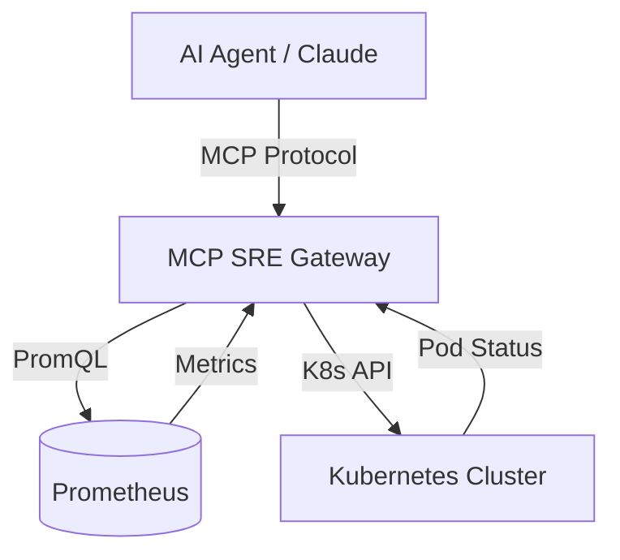

# 🚀 Agentic SRE: Fintech Observability Gateway (MCP)

This repository implements a **Model Context Protocol (MCP)** server tailored for SREs and Platform Engineers working in high-scale Fintech environments. It bridges the gap between LLMs (like Claude) and your Kubernetes/Observability stack.

## 🏗️ System Architecture

The AI Agent (Client) connects to this MCP Server to perform real-time diagnostic tasks:
- **Metrics:** Queries Prometheus for service-level latencies (p95).
- **Orchestration:** Inspects Kubernetes namespaces for unhealthy pods.
- **Protocol:** Stdio-based Model Context Protocol.

## 📁 Project Structure
- `src/server.py`: The main entry point for the MCP server.
- `src/tools/`: Modularized diagnostic tools (Prometheus & K8s).
- `requirements.txt`: Python dependencies.
- `Dockerfile`: Containerization for cluster deployment.

## 🛠️ Tech Stack
- **Language:** Python 3.12+
- **Framework:** FastMCP
- **Libraries:** kubernetes-client, requests
- **Observability:** Prometheus, K8s API

## 🚢 Helm Chart (Deployment)
Easily deploy the MCP Gateway to your cluster using Helm:

```bash
cd charts/mcp-sre-gateway
helm install mcp-prod .
```

## 🏗️ Infrastructure as Code (Terraform)
The project includes Terraform manifests to provision the required Kubernetes infrastructure.

```bash
cd terraform
terraform init
terraform apply
```

## 🚀 Getting Started

### Prerequisites
- Python 3.12+
- Access to a Kubernetes cluster (or local kubeconfig)

### Installation
```bash
python3 -m venv venv
source venv/bin/activate
pip install -r requirements.txt
```

### Running Locally
```bash
# Set your Prometheus address
export PROMETHEUS_URL="http://your-prometheus:9090"

# Run the server
python3 src/server.py
```

## 🔧 Available Tools
- `get_p95_latency(service_name)`: Fetches real-time latency metrics.
- `get_pod_status(namespace)`: Scans K8s for failing pods.

---
*Built for reliability. Let's build systems that don't break.* 🛠️
